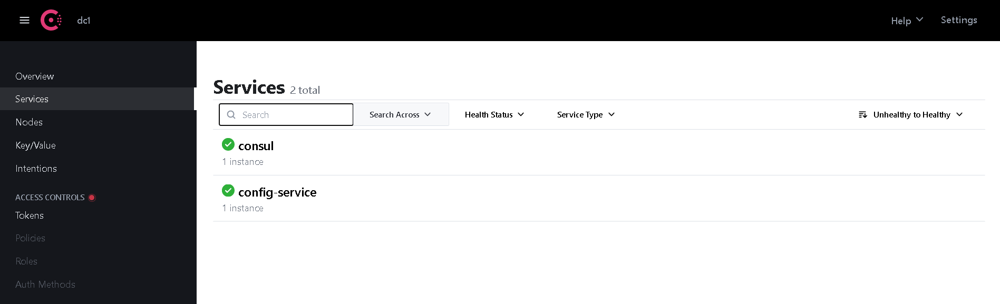
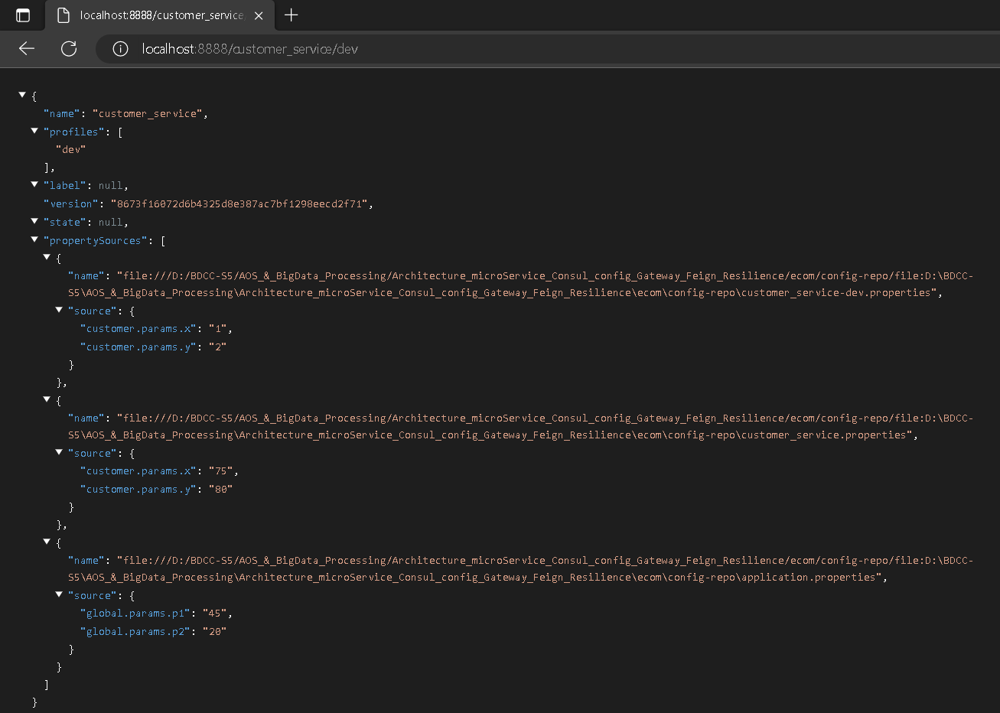
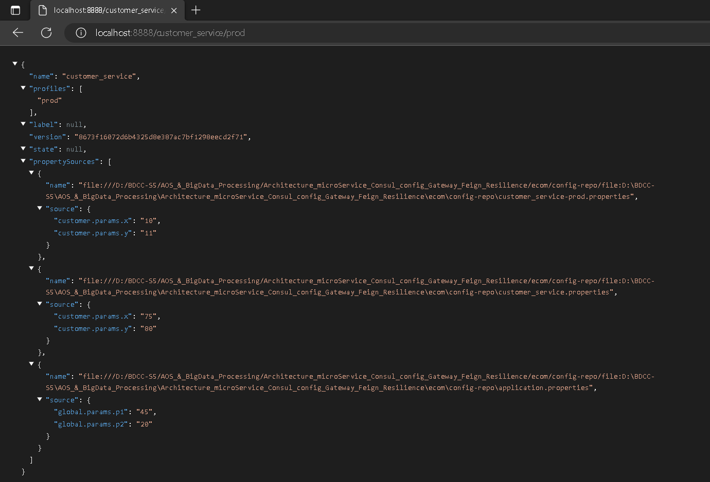
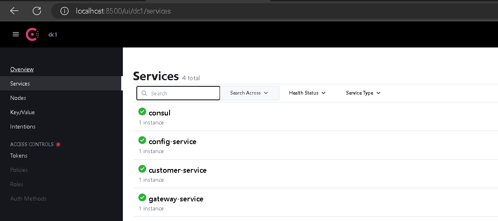
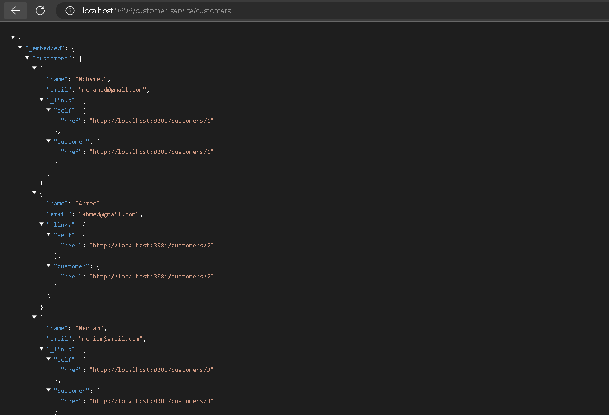

# Architecture microService avec Spring Cloud : Use Case

#### Application overview


#### Project stucture

```Java
project   
└───config_service
│
└───customer_service
│
└───inventory_service
│
└───order_service
│
└───gateway_service
│
└───ecom
|   |
|   └───config-repo
│       │   application.properties  // global configs (shared by all service)
│       │   customer_service.properties  // default config for customer_service (if no env specified)
|       │   customer_service-dev.properties  // customer_service config for dev env
|       │   customer_service-prod.properties  // customer_service config for prod env
│       │   ...
│   
```

#### Dependencies
##### Config service
- Config server
- Spring Boot Actuator
- Consul Discovery

##### Customer service - Inventory service - Order service
- Spring web
- Spring Data JPA
- H2 database
- Lombok
- Rest Repositories
- Consul Discovery
- Spring Boot Actuator
- Config client

##### Gateway service
- Consul Discovery
- Spring Boot Actuator
- Gateway
- Config client

#### Tools
- **Consul :** HashiCorp Consul is a service networking solution that enables teams to manage secure network connectivity between services and across on-prem and multi-cloud environments and runtimes. Consul offers service discovery, service mesh, traffic management, and automated updates to network infrastructure device. You can use these features individually or together in a single Consul deployment. 
    - Get it from [consul.io](https://consul.io)
    - Launch it with 
        - `cd {consulEXE dir}`
        - `consul agent -server -bootstrap-expect=1 -data-dir=consul-data -ui -bind={ip@}`
    - Access it : `localhost:8500` 

#### Code
##### Configuration properties
- An empty project that contains properties of different services 
```Java
ecom
   |
   └───config-repo
       │   application.properties
       │   customer_service.properties
       │   customer_service-dev.properties
       │   customer_service-prod.properties
       │   ...
```
- For every modification, we need to commit changes, so those modifs will be taken into consideration

##### Config Service
###### Application
```Java
@SpringBootApplication
@EnableConfigServer // Enable config server to serve configuration files
@EnableDiscoveryClient // Enable discovery client to register with Consul
public class ConfigServiceApplication {

	public static void main(String[] args) {
		SpringApplication.run(ConfigServiceApplication.class, args);
	}
}
```
###### properties
```Properties
server.port=8888
spring.application.name=config-service
spring.cloud.config.server.git.uri=file:///{config-repo dir}
```

When launching the application, it will be automaticly registred to Consul discovery, due to consul discovery dependency

```Java
<dependency>
			<groupId>org.springframework.cloud</groupId>
			<artifactId>spring-cloud-starter-consul-discovery</artifactId>
</dependency>
```







##### Customer Service
###### Properties 
```Properties
  server.port = 8081
  # Application name has to be the same as in conf-repo/{application-name}.properties, in order to get configuration from config-service
  spring.application.name=customer_service
  # Actuator exposes all its endpoints 
  management.endpoints.web.exposure.include=*
  # from where to import configuration (config server url)
  spring.config.import=optional:configserver:http://localhost:8888
  # Actuator exposes all its endpoints
  management.endpoints.web.exposure.include=*
  # Has to be added to customer-service properties in dev (forprod we don't use h2, but mysql for example) 
  spring.datasource.url=jdbc:h2:mem:customer-db
  # Has to be added to application properties (because it's shared between multiple services)
  spring.h2.console.enabled=true
```
###### RestController
```Java
@RestController
@RefreshScope // Enable refresh scope to refresh configuration values
public class CustomerConfigRestController {
    @Value("${global.params.p1}")
    private String p1;
    @Value("${global.params.p2}")
    private String p2;
    @Value("${customer.params.x}")
    private String x;
    @Value("${customer.params.y}")
    private String y;

    @GetMapping("/params")
    public Map<String,String> params() {
        return Map.of("p1", p1, "p2", p2, "x", x, "y", y);
    }
}
```

###### Enable Auto-configuration with Actuator
- **Auto-configuration** : Re-Configure microServices without re-running them
- **Actuator** : Spring Boot Actuator provides additional auto-configuration to decorate your application with features that make it instantly deployable and supportable in production. For instance if you are writing a JSON web service then it will provide a server, security, logging, externalized configuration, management endpoints, an audit abstraction, and more. If you want to switch off the built in features, or extend or replace them, it makes that really easy as well.
  - To enable it (this has to be automated for production): 
      - Add `@RefreshScode` to service controller 
      - Add `management.endpoints.web.exposure.include=*` to service properties
      - make changes in service properties in configservice
      - commit changes
      - run HTTP POST request :
          - tools -> HTTP Client -> Create Request in HTTP Client
          - Request :
```Java
  POST http://localhost:{service_port}/actuator/refresh
  Accept: application/json
```


##### Gateway Service
###### Properties
```Properties
server.port = 9999
spring.application.name=gateway-service
# search remaining properties in config server
spring.config.import=optional:configserver:http://localhost:8888
```

###### Application
```Java
@SpringBootApplication
public class GatewayServiceApplication {

	public static void main(String[] args) {
		SpringApplication.run(GatewayServiceApplication.class, args);
	}


	// Dynamic configuration of routes
	@Bean
	DiscoveryClientRouteDefinitionLocator dynamicRoutes(ReactiveDiscoveryClient rdc,
														DiscoveryLocatorProperties dlp) {
		return new DiscoveryClientRouteDefinitionLocator(rdc, dlp);
	}
}
```




