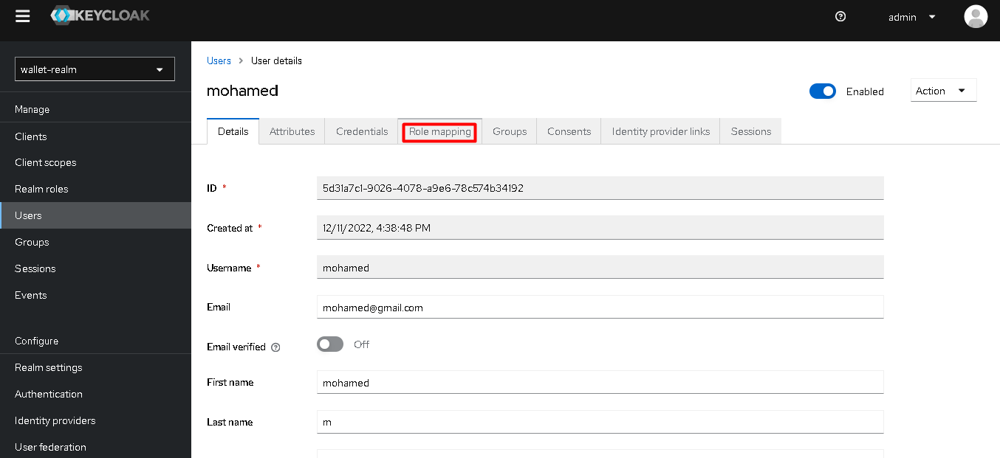
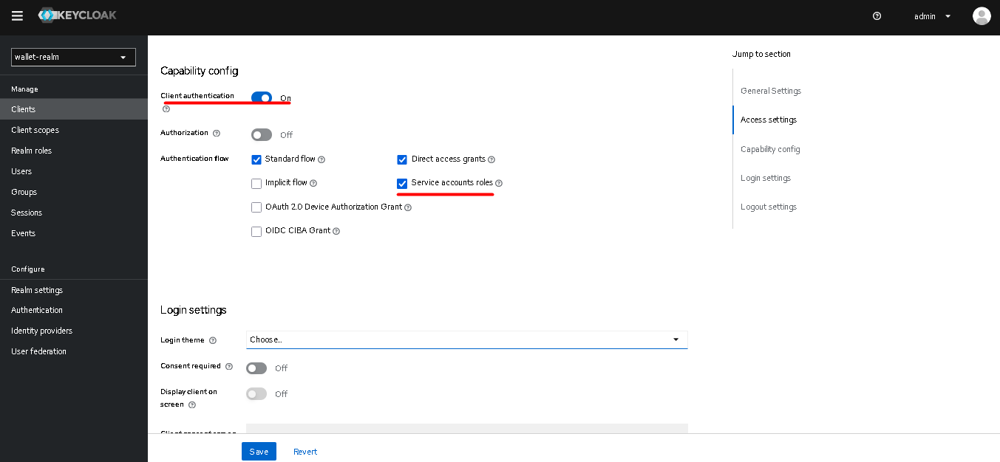

## How To Secure Distributed Systems Using Oauth2 OIDC JWT
### Keycloak :
  - install from : [keycloak](https://www.keycloak.org/downloads)
  - Launch Keycloak server: **keycloak/bin >** `kc.[bat/sh] start-dev`
  - Because keycloak is based on JPA, it needs a database (by default it uses H2, but we can use MySQL, Postgres, Oracle, etc.)
  - To configure a specific database :
      - Before launching server : **keycloak/bin >** `kc.[bat/sh] build  --db {db}` (db = h2, mysql, postgres, oracle, etc.)
      - launch server : **keycloak/bin >** `kc.[bat/sh] start-dev --db={db} --db-url={dbUrl} --db-username={dbUsername} --db-password={dbPassword}`
  - Access keycloak admin console : `http://localhost:8080`
  - Create an admin account :

  
  - Create a Realm : 
      - Realm is is a concept in Keycloak that refers to an object managing a set of users along with their credentials, roles and groups. A user in Keycloak belongs to only one realm and the user who logs in to Keycloak will log into that user’s realm. We can have multiple realms in a Keycloak server, these realms will be independent of each other and they only manage their users.
      - **Master** (default realm) : the realm with the highest power in the realm of the Keycloak server, the admin user in the master realm will have the right to view and manage the other realm.

  - Create Clients :
 

  - Create Users : 

  - Create Roles :

  - Assign Roles to Users :

- Test With Postman :

  - Authentication with password :

  - JWT Access Token content :

  - Authentication with refresh token :

  - Authentication with ClientID and ClientSecret :

  - Change Tokens parameters :

 

### Secure microservices architecture with Keycloak
- In this part, We will secure the last project I worked on with keycloak, you can find it here: [microservices-architecture](https://github.com/m0hamedAit/microservice_architecture/tree/main/Architecture_microService_SpringCloud_ConsulDiscovery_ConsulConfig_Vault)

#### How to secure a REST API with Keycloak

