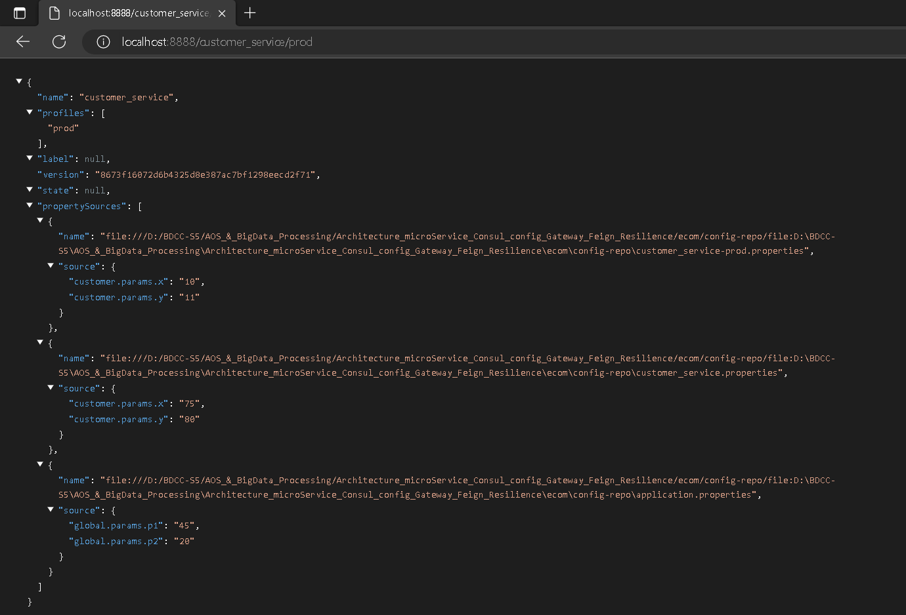

# Architecture microService avec Spring Cloud : Use Case

#### Application overview


#### Project stucture

```Java
project   
└───config_service
│
└───customer_service
│
└───inventory_service
│
└───order_service
│
└───gateway_service
│
└───ecom
|   |
|   └───config-repo
│       │   application.properties  // global configs (shared by all service)
│       │   customer_service.properties  // default config for customer_service (if no env specified)
|       │   customer_service-dev.properties  // customer_service config for dev env
|       │   customer_service-prod.properties  // customer_service config for prod env
│       │   ...
│   
```

#### Dependencies
##### Config service
```Code
- Config server
- Spring Boot Actuator
- Consul Discovery
```

##### Customer service - Inventory service
```Code
- Spring web
- Spring Data JPA
- H2 database
- Lombok
- Rest Repositories
- Consul Discovery
- Spring Boot Actuator
- Config client
```

##### Order service
```Code
- Spring web
- Spring Data JPA
- H2 database
- Lombok
- Rest Repositories
- Consul Discovery
- Spring Boot Actuator
- Config client
- Openfeign  // To communicate with other services, OpenFeign is a REST Client that works in a declarative way, by creating an interface, we can communicate with a REST api
- Spring HATEOAS  // because we use Spring data Rest that uses a Json format that respect the HATEOAS norm
```

##### Gateway service
```Code
- Consul Discovery
- Spring Boot Actuator
- Gateway
- Config client
```

#### Tools
- **Consul :** HashiCorp Consul is a service networking solution that enables teams to manage secure network connectivity between services and across on-prem and multi-cloud environments and runtimes. Consul offers service discovery, service mesh, traffic management, and automated updates to network infrastructure device. You can use these features individually or together in a single Consul deployment. 
    - Get it from [consul.io](https://consul.io)
    - Launch it with 
        - `cd {consulEXE dir}`
        - `consul agent -server -bootstrap-expect=1 -data-dir=consul-data -ui -bind={ip@}`
    - Access it : `localhost:8500` 
  
- **ZipKin** : a distributed tracing system. It helps gather timing data needed to troubleshoot latency problems in service architectures.
    - Get it from [eipkin.io](https://zipkin.io)
    - 

#### Code
##### Configuration properties
- An empty project that contains properties of different services 
```Java
ecom
   |
   └───config-repo
       │   application.properties
       │   customer_service.properties
       │   customer_service-dev.properties
       │   customer_service-prod.properties
       │   ...
```
- For every modification, we need to commit changes, so those modifs will be taken into consideration

##### Config Service
###### Application
```Java
@SpringBootApplication
@EnableConfigServer // Enable config server to serve configuration files
@EnableDiscoveryClient // Enable discovery client to register with Consul
public class ConfigServiceApplication {

	public static void main(String[] args) {
		SpringApplication.run(ConfigServiceApplication.class, args);
	}
}
```
###### properties
```Properties
server.port=8888
spring.application.name=config-service
spring.cloud.config.server.git.uri=file:///{config-repo dir}
```

When launching the application, it will be automaticly registred to Consul discovery, due to consul discovery dependency

```Java
<dependency>
			<groupId>org.springframework.cloud</groupId>
			<artifactId>spring-cloud-starter-consul-discovery</artifactId>
</dependency>
```





##### Customer Service
###### Properties 
```Properties
  server.port = 8081
  # Application name has to be the same as in conf-repo/{application-name}.properties, in order to get configuration from config-service
  spring.application.name=customer_service
  # Actuator exposes all its endpoints 
  management.endpoints.web.exposure.include=*
  # from where to import configuration (config server url)
  spring.config.import=optional:configserver:http://localhost:8888
  # Actuator exposes all its endpoints
  management.endpoints.web.exposure.include=*
  # Has to be added to customer-service properties in dev (forprod we don't use h2, but mysql for example) 
  spring.datasource.url=jdbc:h2:mem:customer-db
  # Has to be added to application properties (because it's shared between multiple services)
  spring.h2.console.enabled=true
```
###### RestController
```Java
@RestController
@RefreshScope // Enable refresh scope to refresh configuration values
public class CustomerConfigRestController {
    @Value("${global.params.p1}")
    private String p1;
    @Value("${global.params.p2}")
    private String p2;
    @Value("${customer.params.x}")
    private String x;
    @Value("${customer.params.y}")
    private String y;

    @GetMapping("/params")
    public Map<String,String> params() {
        return Map.of("p1", p1, "p2", p2, "x", x, "y", y);
    }
}
```

###### Enable Auto-configuration with Actuator
- **Auto-configuration** : Re-Configure microServices without re-running them
- **Actuator** : Spring Boot Actuator provides additional auto-configuration to decorate your application with features that make it instantly deployable and supportable in production. For instance if you are writing a JSON web service then it will provide a server, security, logging, externalized configuration, management endpoints, an audit abstraction, and more. If you want to switch off the built in features, or extend or replace them, it makes that really easy as well.
  - To enable it (this has to be automated for production): 
      - Add `@RefreshScode` to service controller 
      - Add `management.endpoints.web.exposure.include=*` to service properties
      - make changes in service properties in configservice
      - commit changes
      - run HTTP POST request :
          - tools -> HTTP Client -> Create Request in HTTP Client
          - Request :
```Java
  POST http://localhost:{service_port}/actuator/refresh
  Accept: application/json
```


##### Gateway Service
###### Properties
```Properties
server.port = 9999
spring.application.name=gateway-service
# search remaining properties in config server
spring.config.import=optional:configserver:http://localhost:8888
```

###### Application
```Java
@SpringBootApplication
public class GatewayServiceApplication {

	public static void main(String[] args) {
		SpringApplication.run(GatewayServiceApplication.class, args);
	}


	// Dynamic configuration of routes
	@Bean
	DiscoveryClientRouteDefinitionLocator dynamicRoutes(ReactiveDiscoveryClient rdc,
														DiscoveryLocatorProperties dlp) {
		return new DiscoveryClientRouteDefinitionLocator(rdc, dlp);
	}
}
```


##### Inventory Service
###### Properties
```Properties
    server.port=8082
    spring.application.name=inventory-service
    spring.config.import=optional:configserver:http://localhost:8888
```

###### Product Entity
```Java
@Entity
@Data @NoArgsConstructor @AllArgsConstructor @Builder
public class Product {
    @Id
    @GeneratedValue(strategy = GenerationType.IDENTITY)
    private Long id;
    private String name;
    private double price;
    private int quantity;
}
```

###### Product Projection
When using Spring Data JPA to implement the persistence layer, the repository typically returns one or more instances of the root class. However, more often than not, we don't need all the properties of the returned objects.

In such cases, we might want to retrieve data as objects of customized types. These types reflect partial views of the root class, containing only the properties we care about. This is where projections come in handy.
```Java
@Projection(name = "fullProduct", types = Product.class)
public interface ProductProjection {
    public Long getId();
    public String getName();
    public double getPrice();
    public int getQuantity();
}

```

###### Product Repository
```Java
@RepositoryRestResource
public interface ProductRepository extends JpaRepository<Product, Long> {
}
```

###### Application
```Java
@SpringBootApplication
@EnableDiscoveryClient
public class InventoryServiceApplication {

	@Autowired
	private ProductRepository productRepository;

	public static void main(String[] args) {
		SpringApplication.run(InventoryServiceApplication.class, args);
	}

	@Bean
	CommandLineRunner start(ProductRepository productRepository) {
		return args -> {
			Random random = new Random();
			for(int i=0; i<10; i++) {
				productRepository.save(Product.builder()
						.name("Product " + i)
						.price(1000 + Math.random() * 10000)
						.quantity(1+random.nextInt(100))
						.build());
			}
			productRepository.findAll().forEach(System.out::println);
		};
	}
}
```

###### inventory-service.properties 
```Properties
    inv.params.a = 0.5
    inv.params.b = 22
    # Actuator exposes all its endpoints
    management.endpoints.web.exposure.include=*
    spring.datasource.url=jdbc:h2:mem:products-db
```


- We can see that we didn't get IDs, so to specify attributes to get with @RepositoryRestRessource, we use **projections**


##### Order Service
###### Properties
```Properties
    server.port=8085
    spring.application.name=order-service
    spring.config.import=optional:configserver:http://localhost:8888
```

###### Entities
**Order Entity**
```Java
@Entity
@Table(name="orders")  // this table can't be named "Order", cause Order is a reserved word in SQL
@Data @AllArgsConstructor @NoArgsConstructor @Builder
public class Order {
    @Id @GeneratedValue(strategy = GenerationType.IDENTITY)
    private Long id;
    private Date createdAt;
    private OrderStatus status;
    private Long customerId;
    @Transient // to ignore this field in the database
    private Customer customer;
    @OneToMany(mappedBy = "order")
    private List<ProductItem> productItems;
}
```

**ProductItem Entity**
```Java
@Entity
@Data @AllArgsConstructor @NoArgsConstructor @Builder
public class ProductItem {
    @Id @GeneratedValue(strategy = GenerationType.IDENTITY)
    private Long id;
    private Long productId;
    private double price;
    private int quantity;
    private double discount;
    @Transient
    private Product product;
    @ManyToOne
    @JsonProperty(access = JsonProperty.Access.WRITE_ONLY)
    private Order order;
}
```

###### Models
**Customer**
```Java
@Data
public class Customer {
    private Long id;
    private String name;
    private String email;
}
```
**Product**
```Java
@Data
public class Product {
    private Long id;
    private String name;
    private double price;
    private int quantity;
}
```
###### Repositories
**ProductItem Repository**
```Java
@RepositoryRestResource
public interface ProductItemRepository extends JpaRepository<ProductItem, Long> {
}
```
**Order Repository**
```Java
@RepositoryRestResource
public interface OrderRepository extends JpaRepository<Order, Long> {
}
```
###### Services 
**CustomerRestClientService**
```Java
@FeignClient(name = "customer-service")
public interface CustomerRestClientService {
    @GetMapping("/customers/{id}?projection=fullCustomer")
    public Customer customerById(@PathVariable Long id);
    @GetMapping("/customers?projection=fullCustomer")
    public PagedModel<Customer> allCustomers(); // we used hateoas.PagedModel because Get returns a page of customers, not a List
}
```
**InventoryRestClientService**
```Java
@FeignClient(name = "inventory-service")
public interface InventoryRestClientService {
    @GetMapping("/products?projection=fullProduct")
    public PagedModel<Product> allProducts();
    @GetMapping("/products/{id}?projection=fullProduct")
    public Product productById(@PathVariable Long id);
}
```

###### Application
```Java
@SpringBootApplication
@EnableFeignClients
public class OrderServiceApplication {

	public static void main(String[] args) {
		SpringApplication.run(OrderServiceApplication.class, args);
	}

	@Bean
	CommandLineRunner start(
			OrderRepository orderRepository,
			ProductItemRepository productItemRepository,
			CustomerRestClientService customerRestClientService,
			InventoryRestClientService inventoryRestClientService
	){
		return args -> {
			List<Customer> customers = customerRestClientService.allCustomers().getContent().stream().toList();
			List<Product> products = inventoryRestClientService.allProducts().getContent().stream().toList();
			Long customerId = 1L;
			Random random = new Random();
			Customer customer = customerRestClientService.customerById(customerId);
			for(int i = 0; i < 25; i++){
				Order order = Order.builder().customerId(customers.get(random.nextInt(customers.size())).getId())
						.status(OrderStatus.values()[random.nextInt(OrderStatus.values().length)])
						.createdAt(new Date()).build();

				Order savedOrder = orderRepository.save(order);

				for(int j = 0; j < products.size(); j++){
					if(Math.random()>0.5){
						ProductItem productItem = ProductItem.builder()
								.productId(products.get(j).getId())
								.order(savedOrder)
								.quantity(1+random.nextInt(10))
								.price(products.get(j).getPrice())
								.discount(Math.random())
								.build();
						productItemRepository.save(productItem);
					}
				}
			}
		};
	}
}
```
###### RestController
```Java
@RestController
@AllArgsConstructor
public class OrderRestController {

    private OrderRepository orderRepository;
    private ProductItemRepository productItemRepository;
    private CustomerRestClientService customerRestClientService;
    private InventoryRestClientService inventoryRestClientService;

    @GetMapping("/fullOrder/{id}")
    public Order getOrder(@PathVariable Long id) {
        Order order = orderRepository.findById(id).get();
        order.setCustomer(customerRestClientService.customerById(order.getCustomerId()));
        order.getProductItems().forEach(pi -> {
            pi.setProduct(inventoryRestClientService.productById(pi.getProductId()));
        });
        return order;
    }
}
```

###### order-service.properties 
```Properties
    order.params.n = 46
    order.params.m = 47

    management.endpoints.web.exposure.include=*
    spring.datasource.url=jdbc:h2:mem:orders-db
```

###### Screens


