## SOAP Webservice

### Application 

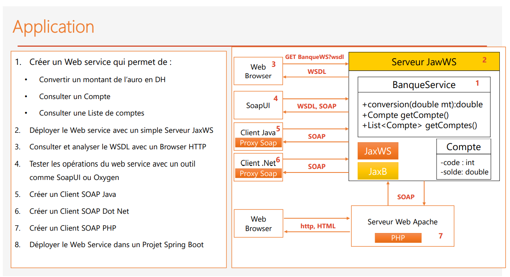

### Architecture 

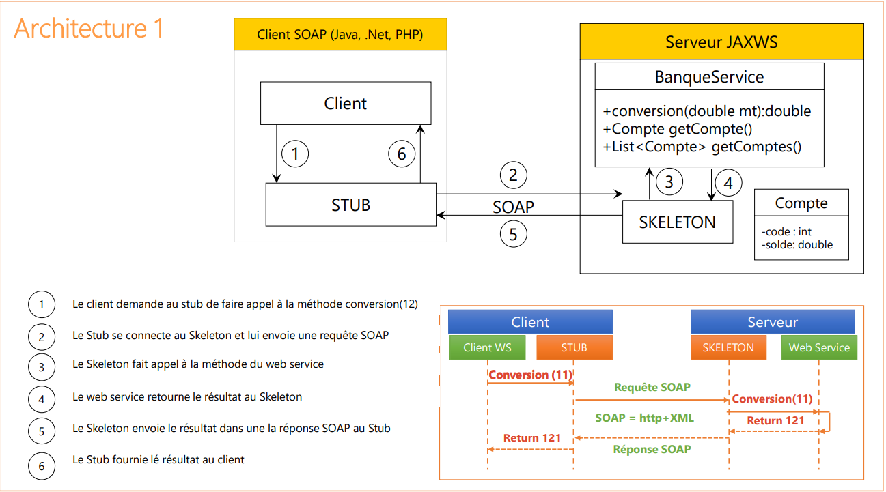

#### Créer le web service

###### Project Dependencies

```Java
<dependencies>
        <!-- https://mvnrepository.com/artifact/org.projectlombok/lombok -->
        <dependency>
            <groupId>org.projectlombok</groupId>
            <artifactId>lombok</artifactId>
            <version>1.18.24</version>
            <scope>provided</scope>
        </dependency>
        <!-- https://mvnrepository.com/artifact/com.sun.xml.ws/jaxws-ri -->
        <dependency>
            <groupId>com.sun.xml.ws</groupId>
            <artifactId>jaxws-ri</artifactId>
            <version>4.0.0</version>
            <type>pom</type>
        </dependency>

    </dependencies>
```

###### le Web service (BankWS)

```Java

@WebService(serviceName="BankWS")
public class BankService {
    @WebMethod(operationName="Convert")
    public double convertEuroToDH(@WebParam(name="montant") double mt) {
        return mt * 10.54;
    }
    @WebMethod
    public Account getAccount(@WebParam(name="code") int code){
        return new Account(code, 1000, new Date());
    }
    @WebMethod
    public List<Account> listAccounts(){
        return List.of(
                new Account(1, 1000, new Date()),
                new Account(2, 2000, new Date()),
                new Account(3, 3000, new Date())
        );

    }
}

//////

@Data @AllArgsConstructor @NoArgsConstructor
public class Account {
    private int code;
    private double solde;
    private Date dateCreation;
}

```

###### Deployer BankService avec un serveur JaxWS

```Java
public class ServerJWS {
    public static void main(String[] args) {
        //demarrer un serveur http dans le port 9191
        Endpoint.publish("http://0.0.0.0:9191/", new BankService());
        System.out.println("> Server started");
    }
}
```

###### Consulter et Analyser le WSDL dans le browser

- **WSDL (Web Services Description Language)** est un langage de description basé sur XML (Extensible Markup Language). La puissance de WSDL est dérivée de deux principes architecturaux principaux: la possibilité de décrire un ensemble d'opérations métier et la possibilité de séparer la description en deux unités de base. Ces unités sont une description des opérations et des détails de la façon dont l'opération et les informations qui lui sont associées sont conditionnées.

WSDL : `localhost:{port}/{WSName}?wsdl`

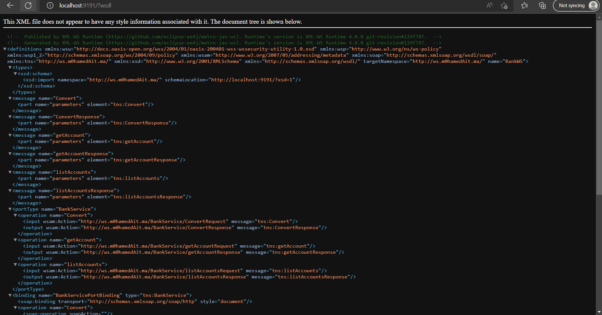

XSD : `localhost:{port}/?xsd=1` # a trouver dans WSDL: <xsd: ... schemaLocation=""/>

###### Tester web service avec SoapUI

Pour tester le web service, on aura besoin de fichier ou lien de WSDL

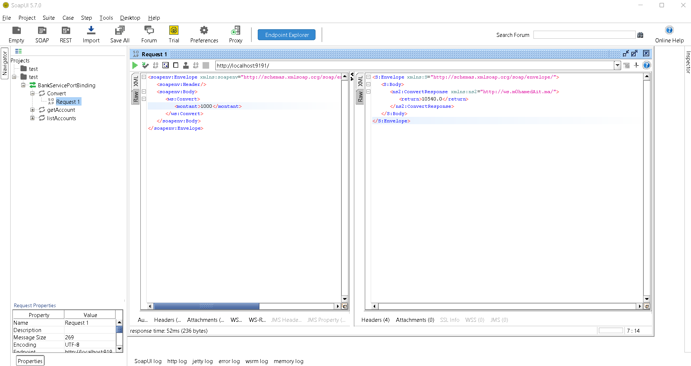
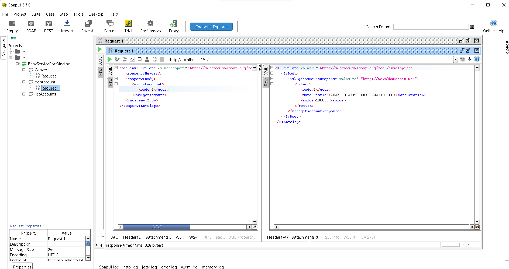
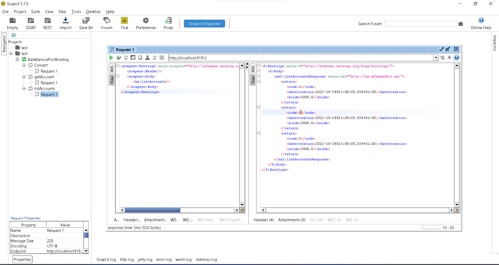

###### Créer un client SOAP Java

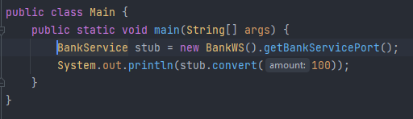
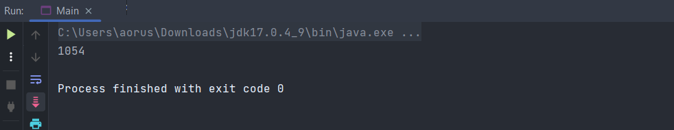

###### Créer un client SOAP Dot Net
Proxy envoi une requête SOAP au serveur, et recupère la reponse, puis la résultat s'affiche sur la console

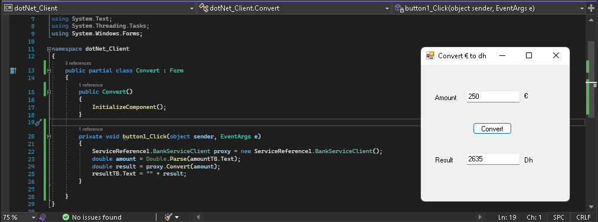

###### Créer unclient SOAP PHP

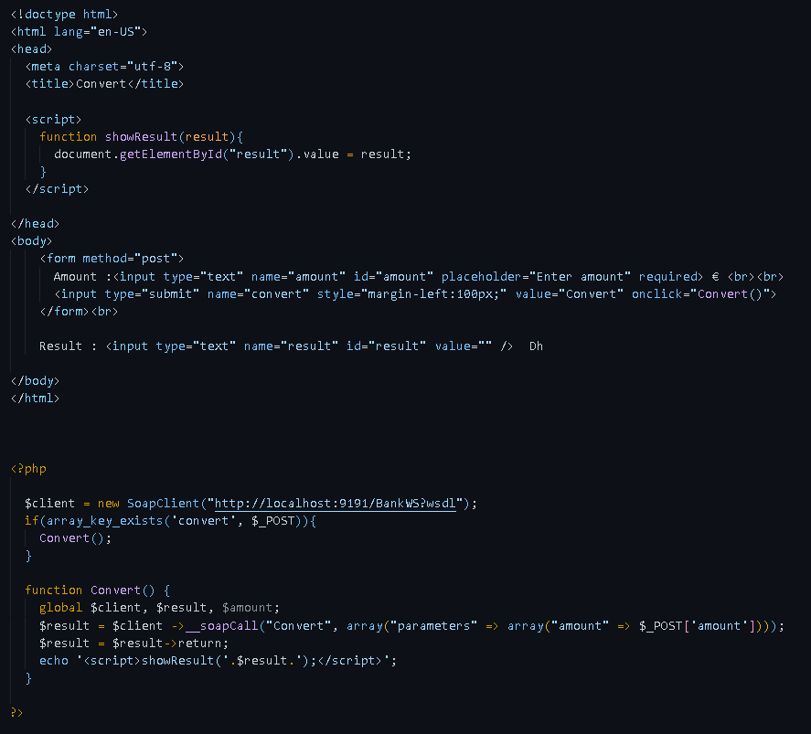
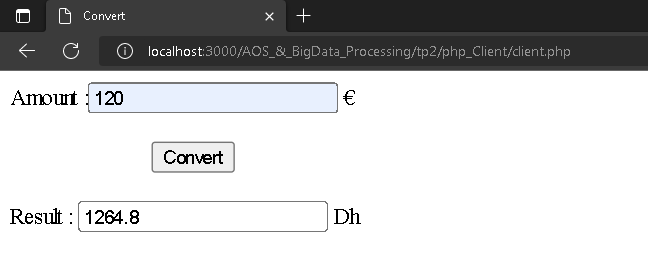


